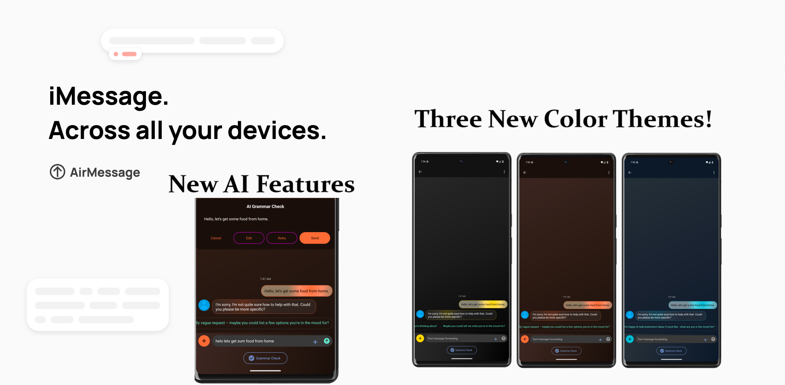

# AirMessage for Android



AirMessage lets people use iMessage on the devices they like.
**AirMessage for Android** is the project's client for Android devices, with an emphasis on feeling like a part of the Android ecosystem.

### ✨ New AI-Powered Features (2025)
AirMessage now includes intelligent messaging features powered by AI:
- **Smart Message Enhancement**: Improve grammar, tone, and clarity of your messages
- **Context-Aware Smart Replies**: Get intelligent reply suggestions based on conversation context
- **Real-time Composition Assistant**: Writing assistance with tone adjustment and auto-complete
- **Custom Themes**: Beautiful new themes including Luxurious, Ocean Breeze, and Sunset Glow

AirMessage for Android can be downloaded from the [Google Play Store](https://play.google.com/store/apps/details?id=me.tagavari.airmessage) or from [F-Droid](https://f-droid.org/packages/me.tagavari.airmessage/).

Other AirMessage repositories:
[Server](https://github.com/airmessage/airmessage-server) |
[Web](https://github.com/airmessage/airmessage-web) |
[Connect (community)](https://github.com/airmessage/airmessage-connect-java)

## Getting started

AirMessage for Android uses [RxJava](https://github.com/ReactiveX/RxJava) to manage its internal logic.
If you're not familiar with RxJava, the repository's README file is a great place to get started:

[https://github.com/ReactiveX/RxJava](https://github.com/ReactiveX/RxJava#readme)

AirMessage for Android hooks in to Google Cloud and Firebase to utilize services like FCM, Google Maps, and Crashlytics.
The app will not build without a valid configuration, so to get started quickly, you can copy the `app/fullRelease/google-services.default.json` file to `app/fullRelease/google-services.json` to use a pre-configured Firebase project, or you may provide your own Firebase configuration file.
Similarly, the app will use the API key found in `secrets.default.properties` for Google Maps by default, and you can supply your own in `secrets.properties`.

## 🤖 AI Features Setup (Ollama Integration)

AirMessage's AI features are powered by [Ollama](https://ollama.ai/), a self-hosted AI model server. To enable AI features:

### Setting up Ollama Server

1. **Install Ollama** on your server or local machine:
   ```bash
   # Linux/macOS
   curl -fsSL https://ollama.ai/install.sh | sh
   
   # Windows (PowerShell)
   iwr -useb https://ollama.ai/install.ps1 | iex
   ```

2. **Download and run the Gemma model**:
   ```bash
   ollama pull orieg/gemma3-tools:4b
   ollama serve
   ```

3. **Configure your server**:
   - The app is pre-configured to connect to `maxwell15000.ddns.net:11434`
   - To use your own server, update the Ollama endpoint in the app settings
   - Ensure your server is accessible via HTTP (port 11434 by default)

### Enabling AI Features

1. **Sign in with Google**: AI features require Google account authentication
2. **Enable AI assistance**: Go to Settings → AI Features and toggle on desired features:
   - Smart message enhancement
   - Context-aware smart replies
   - Real-time composition assistant
3. **Configure preferences**: Adjust tone settings and AI behavior to your liking

### AI Feature Details

- **Message Enhancement**: Uses the `orieg/gemma3-tools:4b` model to improve message quality
- **Smart Replies**: Generates contextually appropriate response suggestions
- **Composition Assistant**: Provides real-time writing assistance with debounced API calls
- **Fallback Support**: Automatically falls back to ML Kit and Android TextClassifier when Ollama is unavailable

## Building and running for AirMessage Connect

In order to help developers get started quickly, we host a separate open-source version of AirMessage Connect at `connect-open.airmessage.org`.
Firebase requires apps to be signed with a designated keystore file in order to enable Google-sign in, so you can copy the `signingshared/shared.keystore.disabled` file to `signingshared/shared.keystore`, which will cause Gradle to use this keystore file in debug builds instead of your local one.

Since this version of AirMessage Connect is hosted in a separate environment from official servers, you will have to be running a version of AirMessage Server that also connects to the same server.

We kindly ask that you do not use AirMessage's official Connect servers with any unofficial builds of AirMessage-compatible software.

---

Thank you for your interest in contributing to AirMessage!
You're helping to shape the future of an open, secure messaging market.
Should you have any questions, comments, or concerns, please shoot an email to [hello@airmessage.org](mailto:hello@airmessage.org).
